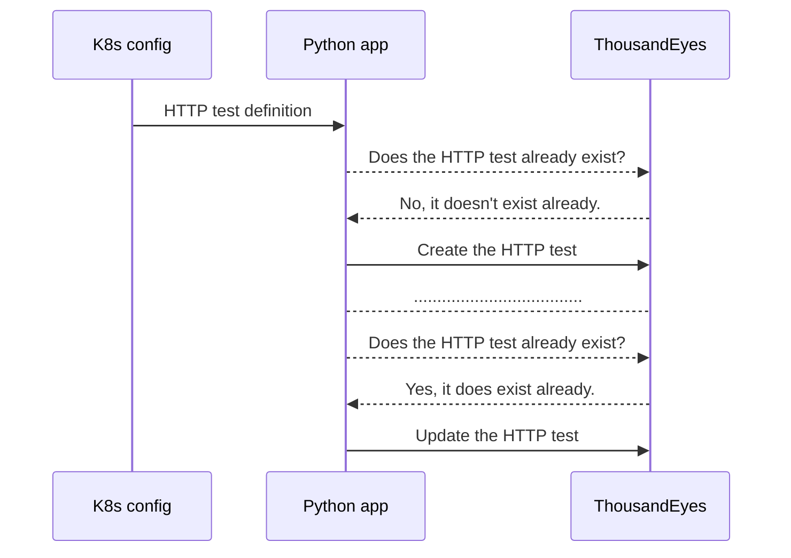

# ThousandEyes sync service for Kubernetes
A service to manage ThousandEyes HTTP test from Kubernetes using configMaps and ThousandEyes API.

## Motivation
In my use case of building a platform, I need to create HTTP test automatically when a new API or service gets deployed, without any manual intervention or effort.

Cisco ThousandsEyes have an IaC [provider to use for Terraform](https://registry.terraform.io/providers/thousandeyes/thousandeyes/latest) , but if you would prefer to implement some kind of GitOps approch for ThousandEyes there are not many options available.

- There is Kubernetes Operator project but it seems deprecated. [See here](https://github.com/CiscoDevNet/thousandeyes-kubernetes-operator)
- Crossplane providers would be a good option but there isn't a provider for it.
- Crossplane Upjet (a project to "convert" Terraform providers into Crossplane providers) could be another option. But it seems a little bit complex. [My attempt here](https://github.com/gorositopablo/provider-thousandeyes). 
- Another option is to use some sort of Terraform inline within Crossplane, but getting Frankenstein thoughts. 


 ## Solution
 This IS NOT an universal answer. But it is indeed a good solution for my problem.
 > Create HTTP test in ThousandEyes automatically without even think on them.

Create a service that perform API operations using the ThousandEyes API to create or update the HTTP Test on the fly. 
This should be able to use in a GitOps approach.

### How it works
- You define a `configMap` with the httptest definition. In my use case, these configMaps gets created automatically from a Helm deployment, so all you need is to add a new `configMap` template in your Helm Chart.
- The service reads all the configmaps that have the label `app: thousandeyes-tests`
- It will check by the URL to check field if the test already exist or not  (https://developer.cisco.com/docs/thousandeyes/list-http-server-tests/)
- If it doesn't exist already, creates the http test using the parameters defined in the configmap (https://developer.cisco.com/docs/thousandeyes/create-http-server-test/)
- If it does indeed already exist, it will try to update according to whatever content you fill in the configmap  (https://developer.cisco.com/docs/thousandeyes/update-http-server-test/)
- Once deployed, the pod will watch for any configmaps changes to create or update the HTTP test.



## How to use it
1- Create a bearer Token in ThousandEyes to use.
2- Add that secret in Kubernetes. Use your preferred method.
3- Deploy all the needed configmaps you may need to create or managed your HTTP tests. 
4- Deploy this service on your cluster using your preferred way. There are files within this repo on the `/kubernetes` folder as example.

### Config definition

```yaml
apiVersion: v1
kind: ConfigMap
metadata:
  name: thousandeyes-api-tests
  namespace: ops
  labels:
    app: thousandeyes-tests
data:
  config.yaml: |
    dryRun: false  # Set to false to apply real changes
    httpTests:
      - testName: "The name of your test here"
        url: "https://httpbin.demo.aws.flanksource.com/status/200"
        description: "Playbook or any other useful data here"
        interval: 600
        alertsEnabled: true
        enabled: false
        verifyCertificate: true
        # Cloud Agents are not supported for bandwidth measurements, only Enterprise Agents will perform bandwidth measurements
        bandwidthMeasurements: false
        mtuMeasurements: false
        httpTargetTime: 1000
        httpTimeLimit: 10
        # Put here a list of agent you want to use
        agents:
          - "32"
        # Put here a list of alertRules you want to link this test to
        alertRules:
          - "1111111"
          - "2222222"
        # custom headers section  
        headers:
          - "My-custom-header: somevaluehere"
```


## Other stuff  
- Prometheus Metrics endpoint at http://localhost:8000/metrics
- Healthcheck endpoint at http://localhost:5000/health


## Developing
I'm NOT a developer. I'm an SRE/DevOps so if you have a better idea, just go for it.

#### Personal notes
``` sh
git clone https://github.com/gorositopablo/k8s-thousandeyes && cd k8s-thousandeyes
docker build -t gorositopablo/thousandeyes-sync:latest .
docker push gorositopablo/thousandeyes-sync:latest
```
